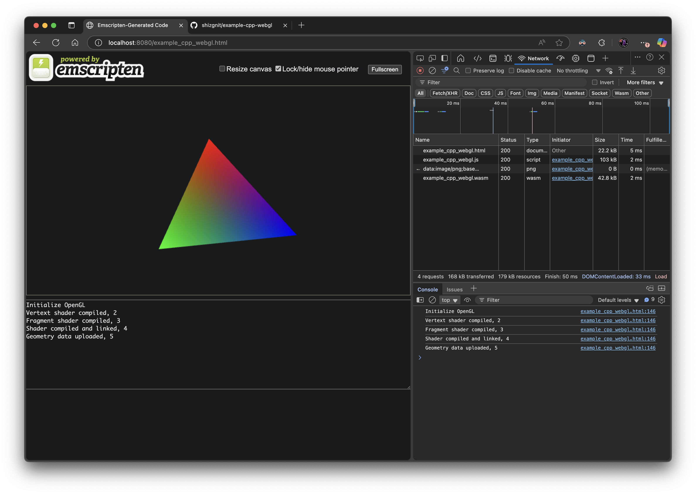

# Example CPP WebGL

This is a basic C++ cmake project example that uses emscripten to create a WebGL application.  The intent is to provide a working example with minimal dependencies.

Currently this project has only been built/tested on MacOS using xcode, which provides the OpenGL framework dependencies.  Emscripten is added as a submodule dependency in <project>/deps/emsdk/.  At some point I may automate some of the manual setup and deployment, but for now it should be a repeatable process.

1) Git clone this repo and update the submodules.

```
git clone https://github.com/shizgnit/example-cpp-webgl.git
cd example-cpp-webgl/
git submodule update --init --recursive
```

2) Setup emscripten.

Sourced from: https://emscripten.org/docs/getting_started/downloads.html

```
cd deps/emsdk/
./emsdk install latest
./emsdk activate latest
cd ../..
source ./deps/emsdk/emsdk_env.sh
```

3) MacOS xcode environment.

```
export SDKROOT=$(xcrun --show-sdk-path)
```

4) Building the code.

```
emcmake cmake -DCMAKE_TOOLCHAIN_FILE=`pwd`/deps/emsdk/upstream/emscripten/cmake/Modules/Platform/Emscripten.cmake .
make
```

5) Deploy and host the application locally.

```
brew install nginx
brew services start nginx
cp example_cpp_webgl.* /opt/homebrew/var/www/
```

Open in browser: http://localhost:8080/example_cpp_webgl.html

[](Screenshot.png)

